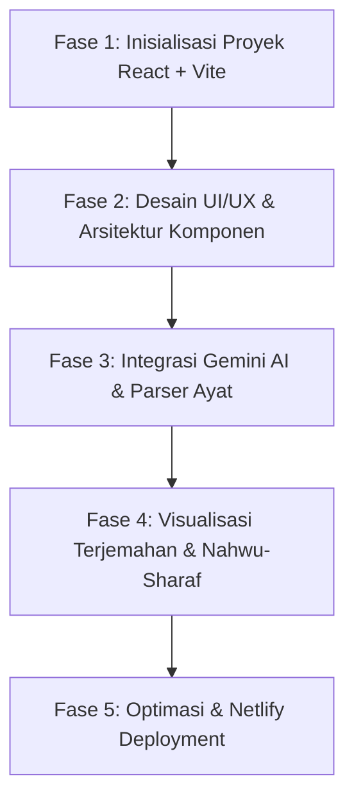

# Rencana Pengembangan Aplikasi: Analisis Nahwu & Sharaf Al-Qur'an Berbasis AI (Gemini)

Dokumen ini berisi panduan dan rencana implementasi arsitektur (*initial plan*) untuk membangun aplikasi web berbasis **React.js** yang memanfaatkan **Google Gemini AI** untuk menyajikan terjemahan per kata serta analisis kaidah tata bahasa Arab (**Nahwu & Sharaf**) dari ayat Al-Qur'an, serta dioptimalkan untuk deployment pada **Netlify**.

---

## 1. Ringkasan Eksekutif & Tujuan Proyek

- **Nama Aplikasi**: Quran Nahwu-Sharaf AI (*atau Al-I'rab Explorer*)
- **Tujuan Utama**: Membantu penuntut ilmu, santri, akademisi, dan masyarakat umum dalam memahami struktur gramatikal bahasa Arab (Nahwu), morfologi/perubahan bentuk kata (Sharaf), serta terjemahan harfiah per kata dari setiap ayat Al-Qur'an secara instan dan akurat dengan bantuan AI.
- **Teknologi Utama**:
  - **Frontend**: React.js (Vite) + Vanilla CSS Modern (Glassmorphism & Islamic Palette)
  - **AI Engine**: Google Gemini API (`gemini-2.5-flash` / `@google/genai`) dengan output JSON terstruktur
  - **Data Al-Qur'an**: Integrasi API teks Al-Qur'an resmi (Kemenag / Al-Quran Cloud / Equran.id) untuk menjamin validitas teks rasm Utsmani
  - **Hosting Platform**: Netlify (Netlify CLI / Netlify Functions / SPA Redirects)

---

## 2. Rencana Tahapan Eksekusi (Phase by Phase)



---

### FASE 1: Inisialisasi Proyek React.js

1. **Setup Project Environment**:
   - Inisialisasi proyek menggunakan Vite untuk kecepatan kompilasi, HMR instan, dan optimasi bundle produksi:
     ```bash
     npm create vite@latest ./ -- --template react
     npm install
     ```
   - Instalasi dependency pendukung:
     - `@google/genai` atau `@google/generative-ai` (Google Gen AI SDK)
     - `lucide-react` (ikon antarmuka modern)
     - Font tipografi Arab Utsmani (misal: *Amiri Quran*, *Scheherazade New*) via Google Fonts
2. **Struktur Folder Proyek**:
   ```
   NAHWU/
   ├── netlify.toml                # Konfigurasi deploy, redirects, dan build Netlify
   ├── netlify/
   │   └── functions/              # (Opsional) Netlify serverless function untuk proxy API Key
   ├── public/
   │   └── favicon.ico
   ├── src/
   │   ├── assets/                 # Kaligrafi, logo, pattern islami
   │   ├── components/
   │   │   ├── Header.jsx          # Header navigasi & informasi tema
   │   │   ├── SearchBar.jsx       # Input surah & ayat cerdas
   │   │   ├── QuranVerseCard.jsx  # Tampilan ayat Arab utuh & terjemahan Kemenag
   │   │   ├── WordAnalysisGrid.jsx# Grid/kartu terjemahan per kata
   │   │   ├── NahwuSharafModal.jsx# Detail rincian Nahwu & Sharaf per kata
   │   │   ├── LoadingSkeleton.jsx # Animasi loading yang halus
   │   │   └── ErrorAlert.jsx      # Penanganan pesan error yang informatif
   │   ├── data/
   │   │   └── surahList.js        # Metadata 114 Surah (ID, Nama Arab, Latin, Jumlah Ayat)
   │   ├── services/
   │   │   ├── geminiService.js    # Logic pemanggilan & prompt engineering Gemini AI
   │   │   └── quranService.js     # Pengambilan ayat rasm Utsmani standar
   │   ├── utils/
   │   │   └── inputParser.js      # Parser input teks (contoh: "Al-Baqarah 255" -> surah: 2, ayat: 255)
   │   ├── App.jsx
   │   ├── App.css
   │   ├── index.css               # Design system, CSS variables, typography
   │   └── main.jsx
   ├── .env.example                # Template konfigurasi environment variables
   └── package.json
   ```

---

### FASE 2: Perancangan Antarmuka & Input Pintar (Single Input)

1. **Pola Input Pengguna (Smart Unified Input)**:
   - Aplikasi menyediakan satu kolom pencarian utama dengan placeholder adaptif:
     - Contoh format yang didukung:
       - Nama Surah & Ayat: `Al-Baqarah: 255` atau `Al Fatihah 1`
       - Nomor Surah & Ayat: `2:255` atau `36:1`
       - Nama Populer: `Yasin 1`, `Al-Mulk 1`, `An-Nas 4`
   - Fitur *Auto-suggest / Autocomplete* nama surah untuk kemudahan pengguna.
2. **Desain Visual & Estetika (Islamic Modern Aesthetic)**:
   - Palet warna bernuansa elegan: *Deep Emerald Green* (`#064e3b`), *Warm Gold Accents* (`#d97706` / `#f59e0b`), dan *Muted Slate/Slate-900* untuk dark mode.
   - Menggunakan rasm Utsmani tajwid-friendly dengan ukuran font Arab yang nyaman dibaca (28px - 36px) dan spasi baris (*line-height*) proporsional.
   - Interaksi kartu interaktif: Setiap kata dalam ayat dapat diklik/di-hover untuk menyorot analisis Nahwu & Sharaf kata tersebut.

---

### FASE 3: Pemrosesan & Rekayasa Prompt Gemini AI

1. **Alur Kerja Pemrosesan**:
   - Pengguna menekan tombol **"Cari & Analisis"**.
   - Input divalidasi dan diubah menjadi parameter surah dan ayat.
   - Teks ayat resmi diambil dari database/API Qur'an terverifikasi (mencegah halusinasi teks Arab oleh AI).
   - Teks ayat dan metadata dikirim ke Gemini AI dengan instruksi ketat (*System Prompt & Schema JSON*).

2. **Schema JSON Output dari Gemini AI**:
   Gemini dikonfigurasi menggunakan mode `response_mime_type: "application/json"` agar menghasilkan data yang terstruktur:
   ```json
   {
     "surah_name": "Al-Fatihah",
     "ayah_number": 1,
     "arabic_full": "بِسْمِ ٱللَّهِ ٱلرَّحْمَٰنِ ٱلرَّحِيمِ",
     "translation_id": "Dengan nama Allah Yang Maha Pengasih, Maha Penyayang.",
     "words": [
       {
         "word_index": 1,
         "arabic": "بِسْمِ",
         "transliteration": "bismi",
         "translation": "Dengan nama",
         "nahwu": {
           "kedudukan": "Jar wa Majrur (حرف جر + اسم مجرور)",
           "i'rab": "Majrur bil-kasrah",
           "tanda_i'rab": "Kasrah pada huruf mim",
           "ta'alluq": "Muta'alliq dengan fi'il mahdzuf (تقديره: أبتدئ)"
         },
         "sharaf": {
           "bentuk_kata": "Isim (اسم)",
           "akar_kata": "س-م-و (S-M-W)",
           "wazan": "فِعْل (Fi'l)",
           "pola_perubahan": "Isim jamid mashdar ghair mimi"
         }
       }
     ],
     "general_grammar_notes": "Ringkasan kaidah tata bahasa penting pada ayat ini..."
   }
   ```

3. **Optimasi Kuota & Kecepatan**:
   - Implementasi **Client-side Caching** (`localStorage` atau `IndexedDB`): Ayat yang sudah pernah dianalisis disimpan secara lokal sehingga tidak mengonsumsi kuota API berulang kali.

---

### FASE 4: Tampilan & Visualisasi Hasil Analisis

1. **Bagian 1: Header Ayat**:
   - Menampilkan kaligrafi nama surah, status Makkiyah/Madaniyah, dan nomor ayat.
   - Tombol audio tilawah (opsional: dari Misyari Rasyid Al-Afasy).
2. **Bagian 2: Teks Ayat Interaktif**:
   - Ayat Arab ditampilkan per token/kata yang bisa diklik.
3. **Bagian 3: Kartu Kata-per-Kata (Word-by-Word Grid)**:
   - Menampilkan kata Arab, harakat, transliterasi, dan arti bahasa Indonesia.
   - Badge status I'rab:
     - 🟢 **Marfu'** (Dhammah)
     - 🔴 **Manshub** (Fathah)
     - 🔵 **Majrur** (Kasrah)
     - ⚪ **Majzum** (Sukun)
4. **Bagian 4: Lembar Analisis Mendalam (Deep Analysis Drawer / Modal)**:
   - Tab **Nahwu**: Kedudukan kalimat (Mubtada', Khabar, Fa'il, Maf'ul, Mudhaf ilaih, Badal, Na'at, dll.).
   - Tab **Sharaf**: Klasifikasi kalimat (Isim/Fi'il/Harf), Fi'il Madhi/Mudhari'/Amr, Tsulatsi Mujarrad/Mazid, Isim Fa'il, Isim Maf'ul, dll.

---

### FASE 5: Optimasi untuk Platform Netlify (Deployment Ready)

1. **Konfigurasi `netlify.toml`**:
   Mempersiapkan konfigurasi otomatis untuk build dan single-page application (SPA) routing:
   ```toml
   [build]
     command = "npm run build"
     publish = "dist"

   [[redirects]]
     from = "/*"
     to = "/index.html"
     status = 200

   [[headers]]
     for = "/*"
     [headers.values]
       X-Frame-Options = "DENY"
       X-Content-Type-Options = "nosniff"
       Referrer-Policy = "strict-origin-when-cross-origin"
   ```

2. **Pengamanan API Key Google Gemini**:
   - **Metode Standar**: Menggunakan Environment Variable di Netlify (`VITE_GEMINI_API_KEY`) yang diakses melalui `import.meta.env.VITE_GEMINI_API_KEY`.
   - **Metode Aman (Direkomendasikan untuk Production)**: Menggunakan **Netlify Serverless Function** (`/.netlify/functions/gemini-nahwu`) sebagai reverse proxy sehingga API key tidak terekspos di browser client.

3. **Checklist Optimasi Produksi**:
   - [x] Minifikasi CSS & JavaScript otomatis oleh Vite.
   - [x] Pemisahan chunk (*vendor splitting*) untuk library berat.
   - [x] Pre-loading font Arab (Amiri) agar tidak terjadi *Flash of Unstyled Text (FOUT)*.
   - [x] Validasi offline fallback & pesan error koneksi/API rate limit.

---

## 3. Checklist Langkah Kerja (Action Plan)

| No | Tugas / Fitur | Status |
|:---|:---|:---:|
| 1 | Inisialisasi proyek React.js menggunakan Vite | ⏳ Pending |
| 2 | Pembuatan file konfigurasi `netlify.toml` & template `.env.example` | ⏳ Pending |
| 3 | Setup CSS Design System (Tema Al-Qur'an, font Amiri, dark/light mode) | ⏳ Pending |
| 4 | Pembuatan utilitas parsing input surah & ayat (`inputParser.js`) | ⏳ Pending |
| 5 | Integrasi modul layanan Google Gemini API (`geminiService.js`) | ⏳ Pending |
| 6 | Pembuatan komponen antarmuka (SearchBar, VerseDisplay, WordAnalysisCard) | ⏳ Pending |
| 7 | Implementasi caching lokal (localStorage) untuk hasil analisis | ⏳ Pending |
| 8 | Pengujian alur (End-to-End Test: Input -> Search -> Render Nahwu & Sharaf) | ⏳ Pending |
| 9 | Build & verifikasi kesiapan deploy ke Netlify (`npm run build`) | ⏳ Pending |

---

*Dokumen ini dibuat sebagai acuan utama implementasi kode proyek Quran Nahwu & Sharaf AI.*
